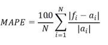

```{r setup, include=FALSE}
knitr::opts_chunk$set(echo = TRUE, warning = FALSE, include = F)
loadPkg = function(x) { if (!require(x,character.only=T, quietly =T)) { install.packages(x,dep=T,repos="http://cran.us.r-project.org"); if(!require(x,character.only=T)) stop("Package not found") } }
```

```{r loadlibraries, include=F}
loadPkg("plotmo")
loadPkg("tidyverse")
loadPkg("glmnet")
loadPkg("dplyr")
loadPkg("caret")
loadPkg("dataPreparation")
loadPkg("factoextra")
loadPkg("dummies")
loadPkg("olsrr")
loadPkg("tree")
loadPkg("rpart")
loadPkg("plyr")
loadPkg("ggplot2")
loadPkg("data.table")
loadPkg("nortest")
loadPkg("corrplot")
loadPkg("faraway")
loadPkg("data.table")
loadPkg("corrplot")
loadPkg("formattable")
loadPkg("tidyr")
# if(!require(devtools)) install.packages("devtools")
# devtools::install_github("kassambara/ggpubr")
loadPkg("ggpubr")
loadPkg("ggcorrplot")
loadPkg("Hmisc")
loadPkg("leaps")
loadPkg("ISLR")
loadPkg("modelr")
```

```{r udf}
# Split the data into training and test set
train_test_split = function(df_sub) {
  # set a seed to get same values for every run
  set.seed(123)
  # divide the train and test data
  training.samples <- df_sub$tip_fare_ratio %>%
    createDataPartition(p = 0.8, list = FALSE)
  
  # Build X_train, y_train, X_test, y_test
  X_train <- df_sub[training.samples, !(names(df_sub) %in% c("tip_fare_ratio", "tip_amount"))]
  y_train <- df_sub[training.samples, c("tip_fare_ratio", "tip_amount")]
  
  X_test <- df_sub[-training.samples, !(names(df_sub) %in% c("tip_fare_ratio", "tip_amount"))]
  y_test <- df_sub[-training.samples, c("tip_fare_ratio", "tip_amount")]
  
  # create list of the return variables
  dfs_list <- list("X_train" = X_train, "y_train" = y_train, "X_test" = X_test, "y_test" = y_test) 
  return(dfs_list)
}

# Accuracy metric MAPE (Mean absolute percentage error)
mape <- function(actual,pred){
           mape <- mean(abs((actual - pred)/actual))*100
           return (mape)
}

# func to get correlation value on a ggplot
corr_eqn <- function(x,y, digits = 2) {
  corr_coef <- round(cor(x, y), digits = digits)
  paste("italic(r) == ", corr_coef)
}

# Plot cooks distance
cooks_distance <- function(df, model){
  
  # calculate cooks distance
  cooksd <- cooks.distance(model)
  
  # data frame size
  sample_size <- nrow(df)
  
  plot(cooksd, pch="*", cex=2, main="Influential Obs by Cooks distance")  # plot cook's distance
  abline(h = 4/sample_size, col="red")  # add cutoff line
  text(x=1:length(cooksd)+1, y=cooksd, labels=ifelse(cooksd>4/sample_size, names(cooksd),""), col="red")  # add label
  
}

# removing outlies
influential_points <- function(df_out, model) {
  # calculate cooks distance
  cooksd <- cooks.distance(model)
  
  # data frame size
  sample_size <- nrow(df_out)
  
  # influential row numbers
  influential <- as.numeric(names(cooksd)[(cooksd > (4/sample_size))])
  print(length(influential))
  
  # subset for the points outside of cooks distance
  df_out <- df_out[-influential, ]
  return (df_out)
}

```

# Introduction

Taxicabs are an integral part of the New York City (NYC) experience. Widely recognized by their yellow color and checkered boxes, there are roughly 13,500 taxicabs in service today, worth about $800,000 each, with 50,000 drivers serving 236 million passengers per year (Devaraj & Patel, 2007).

Our study looks at what affects the amount of tip paid to the driver. This is relevant for a few reasons. Tips are an important part of the service industry, which includes taxicab drivers (Devaraj & Patel, 2017; Azar, 2007; Azar, 2010; Lynn, 2006; Flynn & Greenberg, 2012). In general, tips average around 15% and generate billions of dollars each year (Azar, 2007). Thus, knowing the likelihood of tipping have the potential to provide greater financial certainty for workers. In addition, despite New York law preventing taxicab drivers from refusing service, service refusal still happens (New York City Taxi and Limousine Commission, n.d.; Rivoli & Jorgensen, 2018). It is possible that drivers making assumptions about how likely a customer is to tip (Ayres, Vars, & Zakariya, 2005). Finally, taxicab data can also provide valuable information on city life, city culture, human behavior, and various socioeconomic variables such as economic activity (Ferreira, Poco, Vo, Freire, & Silva, 2013).

# Literature Review

Tips are voluntary payments—in addition to the obligatory transaction amount—usually in the form of money from the customer to service worker who performs a service for them (Devaraj & Patel, 2017). There has been substantial research done on tipping in the restaurant industry, mostly through empirical studies (Azar, 2007).

Tipping behavior can be explained by both economic and noneconomic factors (Devaraj & Patel, 2007), such as providing an economic incentive for a higher quality of service (Flath, 2012), wealth (Harris, 1995), the idea of tipping being a social norm (Azar, 2010), gratitude or appreciation of service (Azar, 2010; Lynn, 2001), and weather (Flynn & Greenberg, 2012). The impact of these variables, however, are not agreed upon by researchers (Azar, 2010; Harris, 1995; Lynn, 2001; Azar, 2007; Flynn & Greenberg, 2012). Most of these studies were conducted through interviews, and Azar (2007) stresses the need to consider what is said during an interview versus what a customer actually does. While a customer may in principle agree with the fact that tips should depend on the quality of service, in an actual situation, the social norm of tipping may take precedence over that principle.

## Taxicab Tipping

Non-tipping work related to the NYC dataset has been conducted, especially in regard to pick up and drop off locations (Zhan, Hasan, Ukkusuri, & Kamga, 2013; Neutens, Delafontaine, Scott, & De Maeyer, 2012) and to supply and demand (Qian & Ukkusuri, 2015; Gonzales, Yang, Morgul, & Ozbay 2014). Accessibility/location (Qian & Ukkusuri, 2015), income, population, age, and number of jobs were strongly related to demand (Qian & Ukkusuri, 2015; Gonzales, Yang, Morgul, & Ozbay 2014). Sun and McIntosh (2016) discover that taxicab ridership is lowest in the early mornings and the highest in the evenings. They also note that for short distances, trip time, distance, and fare are all linearly related; however, this relationship grows weaker at greater distances due to the influence of other potential factors.

There exists a paucity of research on tipping in other industries, such as hotel and transportation (Azar, 2007; Devaraj & Patel, 2017). Devaraj and Patel (2017) and Flath (2012) argue that the factors previously discussed have less influence in a taxi setting given the standardized nature of the taxicab service and the minimal interaction between the driver and the passengers. Instead, taxicab tips may be influenced by weather (Devaraj & Patel, 2017), race (Ayres et al., 2005), or wealth (Ayres et al., 2005).


## Relationship to Current Project

In this context, given the lack of research in taxicab tipping, this project seeks to address the gap in research by identifying if there are other factors other than weather that may affect the amount of tipping by those who paid their fares by credit card. Using the variables provided in the NYC taxicab dataset mirrors the appearances the drivers “interact” with; they cannot see wealth or know a passenger’s background, but they can make inferences (and subsequently guess tip amount) based on perception and pickup and dropoff locations (Ayres et al., 2005). Moreover, pickup and dropoff locations may provide some information on a passenger's background since they may be where the passengers live (Lee, Shin, & Park, 2008) or be indicative of people's lifestyles (Lynn, 2006; Kwan, 1999; Neutens et al. 2012; van Ham & Tammaru, 2015).


# Research Question

In this context, our research question is as follows: Using a subset of NYC Yellow Taxi data from June 2019, what factors play a significant role in the prediction of tip-fare ratio (also referred to as tip ratio) and tip amount paid via credit card?


# Data

The source dataset used for the project was taken from the New York City Taxi and Limousine Commission (2019) website (https://www1.nyc.gov/site/tlc/about/tlc-trip-record-data.page). The dataset was collected and provided to the agency by technology providers authorized under the Taxicab & Livery Passenger Enhancement Programs (TPEP/LPEP). 
  
The dataset is available for Yellow Taxi, Green Taxi and For-Hire Vehicle Records from 2009 to 2019. The total size of the complete dataset is over 10 GB. We have randomly sampled and selected 20,000 observations from the latest dataset, June 2019, from Yellow Taxi Records (New York City Taxi and Limousine Commission, 2019), due to hardware limitations. The dataset also comes with an associated data dictionary for download (New York City Taxi and Limousine Commission, 2018).

In the previous project, we loaded data into R and cleaned (preprocess) it so that it could be used for further analysis. Main steps performed during cleaning data include filtering irrelevant columns and values. Relevant columns were then formatted to their correct type. Also we checked if data frame contains any NAs or duplicate values which might affect the final results.

```{r data}
#read_file
df <- read.csv("../Data/taxidata_processed_project2.csv")
# remove zero passenger count
df <- df %>% filter(passenger_count>0)

# select the required columns
df_sub <- df[,c("tip_fare_ratio", "tip_amount", "VendorID",  "passenger_count", "trip_distance", "fare_amount", "congestion_surcharge", "Borough_pu", "Borough_do", "pickup_period", "drop_period", "trip_duration")]

print(dim(df_sub))

# checking for NAs
# any(is.na(df_sub))    # false
# removing duplicate rows
df_sub <- distinct(df_sub)

# convert vendor to factor
df_sub$VendorID <- as.factor(df_sub$VendorID)

# extracting numerical_col
condition <- (!names(df_sub) == "tip_fare_ratio") & (!sapply(df_sub, class) == "factor")

```

Below is the statistics for the selected columns for analysis:

```{r, include = T, echo=F}
# Print summary
summary(df_sub)
```

# Exploratory Data Analysis

Once we have cleaned our data, we start exploratory data analysis by seeking if there exists any kind of relationship between our dependent and independent variables.

## Distribution

The data is approximately normally distributed ready to use for analysis. There are lesser points on the left side of the mean.

```{r normality check of processed data, echo=T, include=T}
#ggplot histogram of tip_fare_ratio for processed df
df_sub %>%
  ggplot(aes(x=tip_fare_ratio)) +
  geom_histogram(aes(y =..density..),  colour = "black", fill = "#66B2FF", binwidth = 0.01) + 
  stat_function(fun = dnorm, args = list(mean = mean(df_sub$tip_fare_ratio), sd = sd(df_sub$tip_fare_ratio))) + ggtitle("Distribution of NYC Taxi Tip fare ratio")
```

## Hypothesis Testing

### Trip distance

```{r subset_2cols, include = FALSE, echo = FALSE}

# Subset data and glimpse data
df_dist <- subset(df_sub, select=c(tip_fare_ratio, trip_distance))
factor_dist <- cut(df_dist$trip_distance, breaks=c(0, mean(df_dist$trip_distance), Inf), labels= c("Shorter Distances","Longer Distances"), 1:2, sep="")
df_dist$trip_distance <- factor_dist 
short_dist <- subset(df_dist, df_dist$trip_distance == "Shorter Distances")
long_dist <- subset(df_dist, df_dist$trip_distance == "Longer Distances")

# Applying 2 Sample t-test below
result_t <- t.test(short_dist$tip_fare_ratio, long_dist$tip_fare_ratio)

```

While trying to find the the variation in tip-fare ratio between short distance (less than 2.4 miles) and long distance (greater than 2.4 miles) commuters of NYC yellow cabs, results (box plot below) obtained tell us that short distance travellers pay larger share of tips relative to their overall fare than those who travel longer distances within NYC radius. 

```{r box_plot, include = T, echo = F}

# box-plot to see who pays more tips 
e <- ggplot(data = df_dist, aes(x = trip_distance, y = tip_fare_ratio, fill=trip_distance)) + 
  geom_boxplot()+ stat_summary(fun.y=mean, geom="point", shape=23, size=4) + 
  labs(x="Distance Travelled", y = "Tip Fare Ratio") + ggtitle("Box Plot for Tip Fare Ratio vs Distance Travelled")
e

```

Apart from just plotting box-plots, we also performed independent two-sample t-test, a significance test that can give us an estimate as to whether different means between two groups are the result of random variation or the product of specific characteristics within the groups.

Our hypotheses for this test are as follows:
<ul>
  <li>Null Hypothesis: H<sub>o</sub>  Average tip fare ratio is same for both short and long distance passenger(s)
  <li>Alternate Hypothesis: H<sub>a</sub> Average tip fare ratio is NOT same for both short and long distance passenger(s)
</ul>

```{r}
# Print result
result_t
```

With significance level of 0.05, we got a p-value very close to zero. We have enough evidence to reject the null hypothesis in favor of alternate hypothesis meaning that people travelling through yellow cabs in NYC tip differently based on distance travelled.


### Trip duration

We hyothesize that there is a relationship between the duration of the trip and the tip-fare ratio. Trip duration is calculated by subtracting pickup time from drop time. Trip duration is the number of minutes taken for the trip.

For this test, our hypotheses were:
<ul>
  <li>Null Hypothesis: H<sub>o</sub>  Average tip fare ratio is same irrespective of Trip Duration
  <li>Alternate Hypothesis: H<sub>a</sub> Average tip fare ratio is NOT same across Trip Duration
</ul>

```{r t test for trip duration, include=FALSE, echo=FALSE}
#Run T-test
trip_duration_ttest <- t.test(df_sub$tip_fare_ratio, df_sub$trip_duration)
td_ttest <- t.test(x = df_sub$trip_duration)
td_ttest$p.value

# Run ANOVA
anova_pickup_period <- aov(tip_fare_ratio ~ pickup_period, data = df_sub)

# Run ANOVA
anova_drop_period <- aov(tip_fare_ratio ~ drop_period, data = df_sub)

#Run T-test
trip_duration_ttest <- t.test(df_sub$tip_fare_ratio, df_sub$trip_duration)
```

From the results, we observe that p-value of `r format(td_ttest$p.value, digits = 3)` is less than 0.05. At a significance level of 0.05, we reject null hypothesis.
We have enough evidence to reject the null hypothesis in favor of alternative hypothesis, meaning that people travelling via yellow cabs in NYC tip differently based on duration of the trip.


### Number of passengers

We hyothesize that there is a relationship between the number of passenger in the car and the tip-fare ratio. We are considering passenger count as a cateogrical variable. There are 6 factors of passenger count varing from 1 to 6.

Our hypotheses are:
<ul>
  <li>Null Hypothesis: H<sub>o</sub>  Average tip fare ratio is same across all classes of passenger count
  <li>Alternate Hypothesis: H<sub>a</sub> Average tip fare ratio is NOT same across all classes of passenger count
</ul>

```{r anova test for passenger_count}

# ANOVA test
anova_tip_amount = aov(tip_fare_ratio ~ passenger_count, data = df_sub)
summary(anova_tip_amount)

```

The mean of all the groups of passenger count does not vary much. Also, the output of ANOVA gives the p-value `r format(summary(anova_tip_amount)[[1]][["Pr(>F)"]][1], digits=3)` which is less than 0.05; hence, we reject null hypothesis. This means that the number of passenger in the car does affect ratio of the tip amount.

### Vendor ID

Similarly, we checked the distribution for the vendor ID and run a t-test to verify the hypoethsis.

```{r t test for vendor ID}

# t test for vendor
ttest_vendor = t.test(tip_fare_ratio ~ VendorID, data = df_sub)
ttest_vendor
```

The p-value `r format(ttest_vendor$p.value, digits=3)` is less than 0.05; hence, we reject null hypothesis and conclude that the vendor does affect tip amount.

### Location

```{r anova_tipratio_location}
# Run ANOVA
anova_tiprat_pu <- aov(tip_fare_ratio ~ Borough_pu, data = df_sub)

# Print ANOVA results
anova_tiprat_pu

# Run ANOVA
anova_tiprat_do <- aov(tip_fare_ratio ~ Borough_do, data = df_sub)

# Print ANOVA results
anova_tiprat_do

```

For tip ratio and location, ANOVA tests give p-values of `r format(summary(anova_tiprat_pu)[[1]][["Pr(>F)"]][[1]], digits=3)` and `r format(summary(anova_tiprat_do)[[1]][["Pr(>F)"]][[1]], digits=3)`. We reject the null hypothesis that the means are the same at a significance level of 0.05. The Tukey HSD test show the following pick up pairs have significant differences in tipping ratio: Manhattan and Brooklyn, and Queens and Manhattan. For drop off pairs, Manhattan and Bronx, Manhattan and Brooklyn, and Manhattan and Queens are significant.

From the previous research, we ran various tests to gain a basic understanding of the data, which can be summarized in this table:

Feature (variable)  |  Test  |  P-value  | Null Hypothesis (H0)  | Decision on H0 |  
-----|-----|-----|--------|--------|  
pickup location | ANOVA | `r format(summary(anova_tiprat_pu)[[1]][["Pr(>F)"]][[1]], digits=3)` | means are equal | reject H0 |  
dropoff location | ANOVA | `r format(summary(anova_tiprat_do)[[1]][["Pr(>F)"]][[1]], digits=3)` | means are equal | reject H0 |  
distance | T-Test | `r format(result_t$p.value, digits=3)` | means are equal | reject H0 |  
pickup time | ANOVA | `r format(summary(anova_pickup_period)[[1]][["Pr(>F)"]][[1]], digits=3)` | means are equal | reject H0 |
dropoff time | ANOVA | `r format(summary(anova_drop_period)[[1]][["Pr(>F)"]][[1]], digits=3)` | means are equal | reject H0 |
passenger count | ANOVA | `r format(summary(anova_tip_amount)[[1]][["Pr(>F)"]][1], digits=3)` | means are equal | reject H0 |
vendor ID | T-test | `r format(ttest_vendor$p.value, digits=3)` | means are equal | reject H0 | 

*based on a significance level of 0.05

It appears that the following variables affect the tip ratio for those who paid by credit card: pickup loation, dropoff location, distance travelled in miles, time of day and passenger count. Using these variables we will try to predict tip-fare ratio. 

## Correlation

Our next step was to look at correlation to see how the data variables relate to each other. For this step, we have Pearson's correlation method to indicate the extent to which two variables are linearly-related. Here, y-variable is tip-fare ratio.

```{r correlation1, include=F, echo=F}
# Create correlation plot
tip_fare_ratio_cor <- cor(df_sub[,condition], df_sub[,c("tip_fare_ratio")], method = c("pearson"))
```

```{r, include=T, echo=F}
# Create correlation plot
corrplot(cor(df_sub[,(!sapply(df_sub, class) == "factor")]),type="upper", method = "number", tl.col="black")
```

The results show that trip distance, fare amount, and trip duration are negatively (and weakly) correlated whereas passenger count and congestion surcharge are not correlated at all with tip-fare ratio.

# Model Building

We first chose linear (univariate, multivariate) regression models see how it fits our data. Linear regression is a standard, typical method that may do a good job explaining the relationship with tip, so we decided to try that first. We also applied step by feature selection, lasso, ridge, elastic net and principal component analysis (PCA) to improve our linear model. We also used decision trees. One advantage of decision trees is its ability to approximate non-linear relationships. As our literature review suggets, for short distances, trip time, distance, and fare are all linearly related, yet this relationship grows weaker at greater distances due to the influence of other potential factors (Sun & McIntosh, 2016). Consequently, there may be in fact a non-linear relationship with tip, too.

## Model Building Preparation

Before building our models, we first prepared our data for modeling building through one hot encoding, creating training and testing sets, and scaling our data.

### One hot encoding 

In order to convert factor columns to numerical columns we have used one hot encoding. One hot encoding converts all factors as a separate boolean column. 

```{r }
# one hot encoding for factor columns
sub_factor_col <- (!(names(df_sub) %in% c("tip_fare_ratio", "tip_amount"))) & (sapply(df_sub, class) == "factor")
new_df_sub <- dummy.data.frame(df_sub[,c(sub_factor_col)],  sep="_")

# add underscore if space in colname
names(new_df_sub) <- gsub(" ", "_", names(new_df_sub))

# bind new df and old df numerical columns
com_df_sub <- cbind(df_sub[,c((!sapply(df_sub, class) == "factor"))], new_df_sub)
```

After one-hot encoding we get a total of `r dim(com_df_sub)[2]` columns. 

### Test train split

To avoid introducing a bias in test using train-data, the train-test split should be performed before (most) data preparation steps for instance scaling. To simulate a train and test set, we randomly split the dataset into 80% train and 20% test.

```{r split the data}
#train and test split (into 4 modules (i.e. X_train, y_train (80%) & X_test, y_test (20%))
splitted_dfs <- train_test_split(com_df_sub)
```

### Scaling variables

After splitting, we need to scale the numerical variables in our test and train datasets because the magnitude of the values might not necessarily be proportional. We calculate the mean and standard deviation of each numerical column for comparison purposes.

```{r scale parameter}
# We have used dataPreparation package to scale data
# Build scales to see mean and sd of numerical columns
scales <- build_scales(dataSet = splitted_dfs["X_train"]$X_train, cols = c(names(df_sub[,condition])), verbose = TRUE)
print(scales)
```

All the variables have different means and standard deviation; thus, we scaled all the variables for our analysis to prevent variables with larger variance from inadvertently impacting the analysis.

```{r scale_all}
# transform train data 
X_train <- fastScale(dataSet = splitted_dfs["X_train"]$X_train, scales = scales, verbose = TRUE)

# fastscale transform test data using statistics of train data 
X_test <- fastScale(dataSet = splitted_dfs["X_test"]$X_test, scales = scales, verbose = TRUE)
```

```{r bind}
# bind train and test X and Y columns 
train <- cbind(X_train, data.frame("tip_fare_ratio" = splitted_dfs["y_train"]$y_train['tip_fare_ratio'], "tip_amount" = splitted_dfs["y_train"]$y_train['tip_amount']))

test <- cbind(X_test, data.frame("tip_fare_ratio" = splitted_dfs["y_test"]$y_test['tip_fare_ratio'], "tip_amount" = splitted_dfs["y_test"]$y_test['tip_amount']))

```

## Tip Ratio

Now that our EDA is complete with tip-fare as dependent variable, the next step is to apply a variety of regression based algorithms allowing us to extract insights from data that we can then use to tell which outcome is likely to hold true for our target variable based on training data. 

Model evaluation metric used for all models are r-squared and mean absolute percentage error (MAPE). Mean absolute error (MAE) or mean squared error (MSE) are scale dependent variables. We wanted to use scale independent model evaluation creteria hence we decided to use MAPE.MAPE is measured as follows:



### Linear regression

We built a linear model with tip amount and the first 3 highly correlated values for 'Tip_Amount': fare_amount (-0.31), trip_distance (-0.27), and trip_duration (-0.23).

```{r }
#Taking best three variables correlated with tip_fare ratio based on Pearson Correlation

#linear model of tip_fare_ratio ~ trip_duration
fit1 <- lm(tip_fare_ratio ~ trip_duration, data = train )
#summary(fit1)
# vif(fit1)
# plot(fit1)


#linear model of tip_fare_ratio ~ trip_duration+fare_amount
fit2 <- lm(tip_fare_ratio ~ trip_duration+fare_amount, data = train )
#summary(fit2)
# vif(fit2)
# plot(fit2)


#linear model of tip_fare_ratio ~ trip_duration+fare_amount+trip_distance
fit3 <- lm(tip_fare_ratio ~ trip_duration+fare_amount+trip_distance, data = train )
#summary(fit3)
#vif(fit3)
#plot(fit3)
```

We subsequently perform ANOVA tests on all the three models. 

The summary for three linear models is:

Fit | Feature (variable)  |  R^2  | ANOVA P-value |
---|-----|-----|-----|  
1 | lm(tip_fare_ratio ~ trip_duration) |`r format(summary(fit1)$r.squared, digits=3)` | -- |
2 | lm(tip_fare_ratio ~ trip_duration+fare_amount) |`r format(summary(fit2)$r.squared, digits=3)` | `r format(anova(fit1,fit2,fit3)[6][["Pr(>F)"]][2], digits=3)` |
3 | lm(tip_fare_ratio ~ trip_duration+fare_amount+trip_distance) |`r format(summary(fit3)$r.squared, digits=3)` | `r format(anova(fit1,fit2,fit3)[6][["Pr(>F)"]][3], digits=3)` |

```{r}
#perform ANOVA to compare three models
anova(fit1,fit2,fit3)
```

At a significance level of 0.05, we observe that the p-value is greater than 0.05 for the third fit, which implies that fit 2 and fit 3 are the same.

```{r, include=TRUE, echo=F}
#Prediction
model.final.pred <- add_predictions(test,fit3)

# Model performance metrics
results_df <- data.frame(
  technique = "Linear(3 vars with best cor-coeffs)",
  dependent = "tip_fare_ratio",
  mape = mape(model.final.pred$tip_fare_ratio, model.final.pred$pred),
  Rsquare = caret::R2(model.final.pred$pred, model.final.pred$tip_fare_ratio)
)

```

```{r cooksdistance removed}
# remove points lying outside of cooks distance. Influential points is a user defined func.
df_out <- influential_points(train, fit3)

# fit a model on the clean dataset using trip duration+fare_amount+trip_distance variables
model_rmcook <- lm(tip_fare_ratio ~ trip_duration+fare_amount+trip_distance, data = df_out)

# print summary of the model
summary(model_rmcook)

# VIF to find correlated variables
vif(model_rmcook)

# predictions
predictions <- predict(model_rmcook, test)

# Model performance metrics
results_df <- rbind(results_df, data.frame(
  technique = "Linear-treated outlier",
  dependent = "tip_fare_ratio",
  mape = mape(test$tip_fare_ratio, predictions),
  Rsquare = caret::R2(predictions, test$tip_fare_ratio)
))
```


```{r}
# Print results
results_df
```


After removal of the outliers from the data there is no improvement in the values for tip fare ratio. For linear with 3 variables with best correlation coefficients, MAPE is `r format(results_df[1, 3], digits=4)` and r-squared is `r format(results_df[1, 4], digits=3)`. For the linear-treated outlier, MAPE is `r format(results_df[2, 3], digits=4)` and r-squared is `r format(results_df[2, 4], digits=3)`.

Since the results are not satisfactory, we perform stepwise feature selection.

### Stepwise regression

We perform the step feature selection with adjusted r-squared scaling.

```{r step_by_feature_selection, include= TRUE}

# build stepwise model using regsubsets
mod_tip_ratio <- regsubsets(tip_fare_ratio ~ .-tip_amount, data = train, nvmax = 14, nbest = 1, method = "backward")

# plot stepwise results using adj r2 as the model evaluation creteria 
plot(mod_tip_ratio, scale = "adjr2", main = "Adjusted R^2")
```

The graph above shows that trip_duration, congestion_surcharge, Borough_do_Unknown are the three features that give maximum adjusted r-squared of 0.11, after which adjusted r-squared remians constant.

Below is the summary from lm with the first 3 features selected with linear model.

```{r, include= TRUE, echo = F}

#Let us select first three features selected by feature selection function above.
fit_feature <- lm(tip_fare_ratio ~ trip_duration+congestion_surcharge+Borough_do_Unknown, data = train )

# print summary of the model
summary(fit_feature)

# VIF to find correlated variables
vif(fit_feature)

#plot(fit_feature)
```

Below is the graph for predicted versus actual values of tip-fare ratio:

```{r, include=TRUE, echo = F}

# Prediction
model.final.pred <- add_predictions(test,fit_feature)

# Plot predicted vs actual
ggplot(model.final.pred,aes(tip_fare_ratio,pred))+geom_point(aes(tip_fare_ratio,pred)) + labs(title="Actual & Predicted Values",
       x="Actual Tip Fare ratio", y = "Predicted Tip Fare ratio")

# Model performance metrics
results_df <- rbind(results_df, data.frame(
  technique = "Linear-Stepwise",
  dependent = "tip_fare_ratio",
  mape = mape(model.final.pred$tip_fare_ratio, model.final.pred$pred),
  Rsquare = caret::R2(model.final.pred$pred, model.final.pred$tip_fare_ratio)
))

```

We improve the model using ridge, lasso, elastic net, and PCA.

### Ridge regression

Ordinary least squares (OLS) finds the coefficients that best fit the data. But OLS doesn’t consider which independent variable is more important than others. It simply finds the coefficients for a given data set. In short, there is only one set of betas to be found, resulting in the lowest ‘Residual Sum of Squares (RSS)’.

The question then becomes “Is a model with the lowest RSS truly the best model?”. Therefore, an OLS model becomes more complex as new variables are added. It can be said that an OLS provides model with lowest bias and the highest variance. It is fixed there, never moves, but we want have a model with low bias as well as low variance. Ridge can fill this gap, and this is also referred to as Regularization. The ridge regression will penalize  coefficients, such that those that are the least efficient in the estimation will "shrink" the fastest. In ridge regression, we can tune the lambda parameter (penalizing factor) so that model coefficients change. 

Ridge regression shrinks coefficients by penalizing; thus the features were scaled for the "starting conditions" to be fair. Next, we iterated through a range of lambda values. The plot below shows shrinking of attributes. Only five attributes with largest coefficient values have been labeled for better visualization.

```{r ridge_tipfareratio2, include=FALSE, echo=FALSE}
# convert data frame to model matrix as required by glmnet
x=model.matrix(tip_fare_ratio~.-tip_amount,train)[,-1]

# df to list 
y = train %>%
  select(tip_fare_ratio) %>%
  unlist() %>%
  as.numeric()

# set seed to get same set of random split for cv every time
set.seed(123)

# fit a model to get different combinations of lamda
cv_lamda = cv.glmnet(x, y, alpha = 0, standardize = FALSE)

# Display the best lambda value
cv_lamda$lambda.min

# Fit the final model on the training data
ridge_model <- glmnet(x, y, alpha = 0, lambda = cv_lamda$lambda.min, standardize = FALSE)

# transform df to model matrix
x.test <- model.matrix(tip_fare_ratio ~.-tip_amount, test)[,-1]

# Make predictions on the test data
predictions <- ridge_model %>% predict(x.test) %>% as.vector()

# Model performance metrics
results_df <- rbind(results_df, data.frame(
  technique = "Ridge",
  dependent = "tip_fare_ratio",
  mape = mape(test$tip_fare_ratio, predictions),
  Rsquare = caret::R2(predictions, test$tip_fare_ratio)
))


# Display regression coefficients
coef(ridge_model)

# plot lamda values
plot(cv_lamda)

# plot actual versus predicted
ggplot(test, aes(x =test$tip_fare_ratio ,y = predictions)) +
  geom_point() +
  labs(title="Actual & Predicted Values",
       x="Fare amount ", y = "Tip amount")

# plot(fit.ridge, xvar="lambda", label = 5)
```


```{r plot_coef_lambda, include = T, echo = F}
# fit a modela and look at ridge plot
fit.ridge <- glmnet(x, y, family="gaussian", alpha=0)
plot_glmnet(fit.ridge, label=5)
```

To choose the best lambda, we consult the MSE versus lambda plot shown below. The best lambda value in our case turns out to be `r cv_lamda$lambda.min`. 

```{r ridge2plt, include = T, echo = F}
# Plot CV for lamba
plot(cv_lamda)
```

But the r-squared (i.e. the amount of variance that our model can account for) is only 12%, which means there is room for a lot improvement.

```{r plot_r2_ridge_ratio, include=TRUE, echo= FALSE}
# Plot graph for glmnet
fit = glmnet(x, y, alpha = 0)
plot(fit, xvar = "dev", label = TRUE)
```

### Lasso regression

This is another type of regularization (L1) technique that can lead to zeroed-out coefficients (in other words, some of the features are completely neglected for the evaluation of output). Thus, Lasso regression not only helps in reducing over-fitting but it can help us in feature selection. 

Again, we iterated through a range of lambda values. The plot below shows how lasso is setting irrelevant attributes coefficients to 0. Only five attributes with largest coefficient values are labeled for better visualization.

```{r lasso_tipfareratio1, include=FALSE, echo=FALSE}
# Prep model parameters
x=model.matrix(tip_fare_ratio~.-tip_amount,train)[,-1]
y = train %>%
  select(tip_fare_ratio) %>%
  unlist() %>%
  as.numeric()

# Find the best lambda using cross-validation
set.seed(123) 
lasso_cv <- cv.glmnet(x, y, alpha = 1, standardize = FALSE)
# Display the best lambda value
lasso_cv$lambda.min

# Plot lambda CV
plot(cv_lamda)

# Fit the final model on the training data
lasso_model <- glmnet(x, y, alpha = 1, lambda = lasso_cv$lambda.min, standardize = FALSE)
# Dsiplay regression coefficients
coef(lasso_model)

# # Make predictions on the test data
x.test <- model.matrix(tip_fare_ratio ~.-tip_amount, test)[,-1]
predictions <- lasso_model %>% predict(x.test) %>% as.vector()

# Model performance metrics
results_df <- rbind(results_df, data.frame(
  technique = "Lasso",
  dependent = "tip_fare_ratio",
  mape = mape(test$tip_fare_ratio, predictions),
  Rsquare = caret::R2(predictions, test$tip_fare_ratio)
))

# Plot predicted vs actual values
ggplot(test, aes(x =test$tip_fare_ratio ,y = predictions)) +
  geom_point() +
  labs(title="Predicted vs Actual Values",
       x="Fare amount ", y = "Tip amount")

```


```{r plot_coef_lasso1, include = T, echo = F}
# Plot lasso coefficients vs lambda
fit.lasso <- glmnet(x, y, family="gaussian", alpha=1)
plot_glmnet(fit.lasso, label=5)
```

To choose the best lambda, we looked at the MSE versus lambda plot as given below. The best lambda value in our case is `r cv_lamda$lambda.min`. 

```{r lasso2plt, include = T, echo = F}
# Plot lambda CV
plot(cv_lamda)
```

As with before, the r-squared is only 12% (as shown in graph below), which means there is room for a lot improvement.

```{r plot_r2_lasso_ratio, include=TRUE, echo= FALSE}
# Plot glmnet coefficients vs fraction deviance
fit = glmnet(x, y, alpha = 1)
plot(fit, xvar = "dev", label = TRUE)
```

### Elastic net

The last penalized regression model that we used for our problem is elastic net, which linearly combines the L1 and L2 penalties of the lasso and ridge methods. Unfortunately, it also did not help in improving R-square value.

### Principal component analysis

As most of our variables were correlated with each other, and there were 27 features, we decided to use PCA as a variable reduction technique.

```{r pca}
# get principal components using prcomp, we have used scale = F as the data is already scaled
pr.out =prcomp(X_train, scale = F)
summary(pr.out)
```

Around 92% of the variance is explained by first 7 components (shown below).

```{r include = T, echo=F}
# calculate how much variance is explained by each component
prop_varex <- pr.out$sdev*2/sum(pr.out$sdev*2)

# plot cumulative variance graph
plot(cumsum(prop_varex), xlab = "Principal Component",
              ylab = "Cumulative Proportion of Variance Explained",
              type = "b", main = "Cumulative variance explained by each component")
```

We then ran a simple linear regression model on those components to check if this increased the variability explained as indicated by r-squared.

```{r pca_tipfareratiom, include = T, echo = F}
#add a training set with principal components
pca_train <- data.frame("tip_fare_ratio" = splitted_dfs["y_train"]$y_train['tip_fare_ratio'], pr.out$x)[,1:8]

#transform test into PCA
test.data <- predict(pr.out, newdata = X_test)
test.data <- as.data.frame(test.data)

# fit lm model with 7 PCAs selected before
model <- lm(tip_fare_ratio ~ ., data = pca_train)
summary(model)
```

As seen from the model summary, all variables are significant, except component 3. The residuals are not symmetric around the median value. The `r format(summary(model)$r.squared)` and `r format( summary(model)$adj.r.squared)` did not improve. Thus, even if the components explains 90% of the variance in the data, that may not necessarily mean that a good R2 or high coefficients will result. We evaluated the metric using MAPE, which is around 22%; there is no significant improvement from the previous results. 

```{r, include=T, echo=F}
# predictions
predictions <- predict(model, test.data)

# Model performance metrics
results_df <- rbind(results_df, data.frame(
  technique = "PCR",
  dependent = "tip_fare_ratio",
  mape = mape(test$tip_fare_ratio, predictions),
  Rsquare = caret::R2(predictions, test$tip_fare_ratio)
))

ggplot(test, aes(y =predictions ,x = test$tip_fare_ratio)) +
  geom_point() +
  labs(title="Actual & Predicted Values",
       x="Actual Tip Fare Ratio $", y = "Predicted Tip Fare Ratio $")

```

The above graph represents predicted tip fare ratio verses actual tip fare ratio. It is evident that predicted varies signifcantly from the actual.

### Decision tree

Finally, we decided to grow a decision tree for our dataset. 

To grow our decision tree, the minimum within node deviance (essentially the minimum deviance for a node to be split) was set to 0.001.

```{r dt_growtree_ratio}
# Grow decision tree
taxi_tree_ratio <- tree(tip_fare_ratio ~ passenger_count + trip_distance + fare_amount + congestion_surcharge + trip_duration + VendorID_1 + VendorID_2 + Borough_pu_Bronx + Borough_pu_Brooklyn + Borough_pu_Manhattan + Borough_pu_Queens + Borough_pu_Unknown + Borough_do_Bronx + Borough_do_Brooklyn + Borough_do_EWR + Borough_do_Manhattan + Borough_do_Queens + Borough_do_Staten_Island + Borough_do_Unknown + pickup_period_Afternoon + pickup_period_Evening + pickup_period_Morning + pickup_period_Night + drop_period_Afternoon + drop_period_Evening + drop_period_Morning + drop_period_Night, data = train, mindev=0.001)

# Print results
summary(taxi_tree_ratio)
```

Here is the decision tree for tip ratio:

```{r dt_plottree_ratio, out.width='100%', out.height='100%', include = T, echo = F}
# Plot tree
#png(file="tree_ratio.png",width=900,height=900,res=30) # Use if want to export
plot(taxi_tree_ratio, main = "Decision Tree for Tip Ratio") 
text(taxi_tree_ratio, cex = 0.75) #2.5)
#dev.off() # Use if want to export
```


One disadvantage of decision trees is its potential to overfit the training data. While the fit may be strong for the training data, overfitting results in the model not fitting the test set particularly well. As such, it is important to prune back the tree by reducing the number of leaves (or terminal nodes).

Here is the best pruned decision tree with only 5 leaves, down from our original of 14 leaves.

```{r dt_plotprunetree_ratio, include = T, echo = F}
# Return best pruned tree with 5 leaves, evaluating error on training data 
tree_ratio_prune <- prune.tree(taxi_tree_ratio, best = 5)

# Plot pruned tree
plot(tree_ratio_prune, main = "Pruned Decision Tree for Tip Ratio") 
text(tree_ratio_prune, cex = 0.75)
```

Another way to prune back the leaves is to use cross-validation. Cross-validation is where the data is broken into multiple sets (or folds). Generally, the folds are divided to train and test the model, with the goal of generalizing the results.

Here is the pruned tree by 10-fold CV:

```{r dt_plotcvtree_ratio, include = T, echo = F}
# Plot tree
tree_ratio_cv = cv.tree(taxi_tree_ratio, best = 4)
plot(tree_ratio_cv, main = "CV Decision Tree for Tip Ratio")
text(tree_ratio_prune, cex = 0.75)
```

```{r dt_accuracy_ratio}
# Original
# Predict test values using tree
tree_ratio_pred = predict(taxi_tree_ratio, newdata = test)

# Obtain MSE
tree_ratio_mse = (sum((tree_ratio_pred - test$tip_fare_ratio)^2)) / nrow(test)

# Print MSE
tree_ratio_mse

# Obtain MAPE and r2
mape_ratio = mape(test$tip_fare_ratio, tree_ratio_pred)
Rsquare_ratio = caret::R2(tree_ratio_pred, test$tip_fare_ratio)

# Model performance metrics
results_df <- rbind(results_df, data.frame(
  technique = "Decision Tree",
  dependent = "tip_fare_ratio",
  mape = mape(test$tip_fare_ratio, tree_ratio_pred),
  Rsquare = caret::R2(tree_ratio_pred, test$tip_fare_ratio)
))

# Prune
# Predict test values using tree
tree_ratio_pred_prune = predict(tree_ratio_prune, newdata = test)

# Obtain MSE
tree_ratio_mse_prune = (sum((tree_ratio_pred_prune - test$tip_fare_ratio)^2)) / nrow(test)

# Print MSE
tree_ratio_mse_prune

# Obtain MAPE and r2
mape_ratio_prune = mape(test$tip_fare_ratio, tree_ratio_pred_prune)
Rsquare_ratio_prune = caret::R2(tree_ratio_pred_prune, test$tip_fare_ratio)

# Model performance metrics
results_df <- rbind(results_df, data.frame(
  technique = "Decision Tree (Prune)",
  dependent = "tip_fare_ratio",
  mape = mape(test$tip_fare_ratio, tree_ratio_pred_prune),
  Rsquare = caret::R2(tree_ratio_pred_prune, test$tip_fare_ratio)
))

# CV
# Predict test values using tree
tree_ratio_pred_cv = predict(tree_ratio_cv, newdata = test)

# Obtain MSE
tree_ratio_mse_cv = (sum((tree_ratio_pred_cv - test$tip_fare_ratio)^2)) / nrow(test)

# Print MSE
tree_ratio_mse_cv

# Obtain MAPE and r2
mape_ratio_cv = mape(test$tip_fare_ratio, tree_ratio_pred_cv)
Rsquare_ratio_cv = caret::R2(tree_ratio_pred_cv, test$tip_fare_ratio)

# Model performance metrics
results_df <- rbind(results_df, data.frame(
  technique = "Decision Tree (CV)",
  dependent = "tip_fare_ratio",
  mape = mape(test$tip_fare_ratio, tree_ratio_pred_cv),
  Rsquare = caret::R2(tree_ratio_pred_cv, test$tip_fare_ratio)
))
```

The accuracy of each can be summarized in this table:

Variable | Original Tree | Pruned Tree | Cross-Validated Tree |
---------|---------------|-------------|----------------------|
variables used | `r summary(taxi_tree_ratio)$used` | `r summary(tree_ratio_prune)$used` | `r summary(tree_ratio_cv)$used` |
leaves | `r summary(taxi_tree_ratio)$size` | `r summary(tree_ratio_prune)$size` | `r summary(tree_ratio_cv)$size` |
in-sample MSE | `r summary(taxi_tree_ratio)$dev / summary(taxi_tree_ratio)$df` | `r summary(tree_ratio_prune)$dev / summary(tree_ratio_prune)$df` | `r summary(tree_ratio_cv)$dev / summary(tree_ratio_cv)$df` |
out-of-sample MSE | `r tree_ratio_mse` | `r tree_ratio_mse_prune` | `r tree_ratio_mse_cv` |
out-of-sample R2 | `r Rsquare_ratio` | `r Rsquare_ratio_prune` | `r Rsquare_ratio_cv` |
MAPE | `r mape_ratio` | `r mape_ratio_prune` | `r mape_ratio_cv` | 

As expected, the original decision tree is the best of the tree, given that it has the lowest MAPE and highest r-squared. This is because the tree was not pruned back to prevent overfitting, so it fits the data the best (out of the three). The pruned tree has a higher MAPE than the cross-validated tree, but the pruned tree has a higher r-squared. All three models, however, do not differ by much when looking at MAPE and r-squared. This indicates that there may not be much differences in the models.

Fare amount appears to be the main predictor of tip ratio. In the three models, the first node split was fare amount, suggesting that there is a difference in tip ratio according to whether a passenger's fare amount is high or low. This notion is further solidified by the fact that the tip ratio terminal node values descend from left to right. This means that the lower the fare amount, the higher proportion of tip is paid to the driver. In this context, passengers with higher fare amounts tend to tip less proportional to their fare amount.

Although the models roughly have 79% accuracy, the model only explains roughly 13-15% of the variation in tip ratio. This suggests that the model is not comprehensive.

### Summary and analysis

The best model, when looking at for a low MAPE and high r-squared, is the unpruned decision tree. It is important to note that looking across the various models, the MAPE value is mostly the same around 21 or 22, which indicates a 78-79% accuracy. The r-squared values for all the models, however, are extremely low, explaining anywhere from 7% to 15% of the variation in our dependent variable. Consequently, this indicates that the models are neither comprehensive nor good, reliable fits.

This also suggests that a null model may be the "best fit" for tip ratio. In this case, tip ratio remains constant despite changes in the independent variables. This may make sense because based on our literature review, tips in the service industry generally hover around 15%; the tips for taxis may also be hovering around a certain percentage.


## Tip Amount

From analysis shown above it is clear that either there is no relation (the null model will work just fine). **Tip-to-fare** is roughly a constant overall, or we do not have the predictors to capture the relationship. Thus, we may need to redefine our dependent variable. We replaced tip-fare ratio with **tip amount** as our dependent variable in models to see if it makes any difference on our results. 

### Distribution

The data has right skewed distribution. 

```{r include=T, echo=F}
# Plot distribution of data
df_sub %>%
  ggplot(aes(x=tip_amount)) +
  geom_histogram(aes(y =..density..),  colour = "black", fill = "#66B2FF", binwidth = 0.05) + 
  stat_function(fun = dnorm, args = list(mean = mean(df_sub$tip_amount), sd = sd(df_sub$tip_amount))) + ggtitle("Distribution of NYC Taxi Tip Data")
```

### Correlation 

```{r correlation2, include=T, echo=F}
# Plot corelation of tip amount
cor(df_sub[,condition], df_sub[,c("tip_amount")], method = c("pearson"))
```

This time, we get stronger and positive correlation coefficients between tip amount and trip distance, fare amount, and trip duration variables. Passenger count and congestion surcharge, however, are not correlated with the tip amount. 

The same relationship can be visually confirmed through scatter plots below:

Below are the scatter plot along with correlation and regression line for numerical variables
```{r scatterplots2, include=T, echo=T}
# Plot correlations and regression line for each variable
Q1 <- ggplot(df_sub, aes(x=trip_distance, y=tip_amount)) +
  geom_point(color = "blue")+
  geom_smooth(method=lm, color = "black") +
  labs(title="Variation in trip distance and tip amount",
       x="Trip distance", y = "Tip amount") +
  geom_text(x = 23, y = 40, label = corr_eqn(df_sub$trip_distance,
                             df_sub$tip_amount), parse = TRUE)

Q2 <- ggplot(df_sub, aes(x=trip_duration, y=tip_amount)) +
  geom_point(color = "red")+
  geom_smooth(method=lm) +
  labs(title="Variation in trip duration and tip amount",
       x="Trip duration", y = "Tip amount")+
  geom_text(x = 30, y = 40, label = corr_eqn(df_sub$trip_duration,
                             df_sub$tip_amount), parse = TRUE)


Q3 <- ggplot(df_sub, aes(x=congestion_surcharge, y=tip_amount)) +
  geom_point(color = "red")+
  geom_smooth(method=lm) +
  labs(title="Variation in congestion surcharge and tip amount",
       x="Congestion surcharge", y = "Tip amount")+
  geom_text(x = 2, y = 40, label = corr_eqn(df_sub$congestion_surcharge,
                             df_sub$tip_amount), parse = TRUE)

Q4 <- ggplot(df_sub, aes(x=passenger_count, y=tip_amount)) +
  geom_point(color = "red")+
  geom_smooth(method=lm) +
  labs(title="Variation in passenger count and tip amount",
       x="Passenger count", y = "Tip amount")+
  geom_text(x = 2, y = 40, label = corr_eqn(df_sub$passenger_count,
                             df_sub$tip_amount), parse = TRUE)
ggarrange(Q1, Q2, Q3,Q4 + rremove("x.text"),
          ncol = 2, nrow = 2)
```

### Linear regression

We built a linear model with tip amount and the first 3 highly correlated values for 'Tip_Amount': fare_amount (0.91), trip_distance (0.83), and trip_duration (0.71).

```{r}

#Taking best three variables correlated with tip_fare ratio

# fit model for tip_amount ~ fare_amount
fit1_ta <- lm(tip_amount ~ fare_amount, data = train )
#summary(fit1_ta)
# vif(fit1_ta)
# plot(fit1_ta)

# fit model for tip_amount ~ fare_amount+trip_distance
fit2_ta <- lm(tip_amount ~ fare_amount+trip_distance, data = train )
#summary(fit2_ta)
# vif(fit2_ta)
# plot(fit2_ta)

# fit model for tip_amount ~ fare_amount+trip_distance+trip_duration
fit3_ta <- lm(tip_amount ~ fare_amount+trip_distance+trip_duration, data = train )
summary(fit3_ta)
# vif(fit3_ta)
#plot(fit3_ta)

```

We then perform ANOVA tests on all the three models.

```{r}
#perform ANOVA to compare three models built
anova(fit1_ta,fit2_ta,fit3_ta)
```

Here's a summary of the results:

Fit | Feature (variable)  |   R^2  |  ANOVA P-value |
---|-----|-----|----|
1 | lm(tip_amount ~ fare_amount) |`r format(summary(fit1_ta)$r.squared, digits=3)` | -- |
2 | lm(tip_amount ~ fare_amount+trip_distance) |`r format(summary(fit2_ta)$r.squared, digits=3)` | `r format(anova(fit1_ta,fit2_ta,fit3_ta)[6][["Pr(>F)"]][2], digits=3)` |
3 | lm(tip_amount ~ fare_amount+trip_distance+trip_duration) |`r format(summary(fit3_ta)$r.squared, digits=3)` | `r format(anova(fit1_ta,fit2_ta,fit3_ta)[6][["Pr(>F)"]][3], digits=3)` |

With a significance level of 0.05, we observe that the p-value is greater than 0.05 for the third fit, which means that the third fit and second fit are pretty much the same.

Below is the graph for predicted versus actual values of tip_amount:

```{r, include=TRUE, echo=F}
# Plot predicted vs actual values
model.final.pred <- add_predictions(test,fit3_ta)
# head(model.final.pred)
ggplot(model.final.pred,aes(tip_amount,pred))+geom_point(aes(tip_amount,pred))+
  labs(title="Predicted versus Actual values for Linear Fit Tip Amount",
       x="Actual tip amount ($)", y = " Predicted tip amount ($)")


# Model performance metrics
results_df <- rbind(results_df, data.frame(
  technique = "Linear(3 vars with best cor-coeffs)",
  dependent = "tip_amount",
  mape = mape(model.final.pred$tip_amount, model.final.pred$pred),
  Rsquare = caret::R2(model.final.pred$pred, model.final.pred$tip_amount)
))
```

The results are good. In order to check if any combination of features set gives us better results than this, we performed stepwise regression.

### Stepwise regression

We performed backward stepwise regression, and variables were selected based on adjusted r-squared:

```{r step_by_feature_selection1, include= TRUE, echo=F}
# Perform stepwise regression (backwards)
mod_tip_ratio <- regsubsets(tip_amount ~ .-tip_fare_ratio, data = train, nvmax = 14, nbest = 1, method = "backward")
plot(mod_tip_ratio, scale = "adjr2", main = "Adjusted R^2")
```

From the graph above, we see that adjusted r-squared remains constant throughout. Hence, we select fare_amount, congestion_surcharge, Borough_do_Bronxn as our first three features that give maximum adjusted r-squared of 0.83.

Below is the summary from lm with the first 3 features selected with feature selection:

```{r, include=TRUE, echo=F}
#Let us select first three features selected by feature selection function above.
fit_feature_ta <- lm(tip_amount ~ fare_amount+congestion_surcharge+Borough_do_Bronx, data = train )
summary(fit_feature_ta) 
# vif(fit_feature_ta)
# plot(fit_feature_ta)

# #perform ANOVA to compare three models built
# anova(fit3_ta,fit_feature_ta)
```

Below is the graph for predicted versus actual values of tip_amount:

```{r, include=TRUE, echo=F}
# Plot predicted versus actual values
model.final.pred <- add_predictions(test,fit_feature_ta)
# head(model.final.pred)
ggplot(model.final.pred,aes(tip_amount,pred))+geom_point(aes(tip_amount,pred)) + labs(title="Predicted versus Actual values for Linear Fit of Tip Amount", x="Actual tip amount ($)", y = " Predicted tip amount ($)")

# Model performance metrics
results_df <- rbind(results_df, data.frame(
  technique = "Linear-Stepwise",
  dependent = "tip_amount",
  mape = mape(model.final.pred$tip_amount, model.final.pred$pred),
  Rsquare = caret::R2(model.final.pred$pred, model.final.pred$tip_amount)
))

```

To further improve the model, ridge, lasso, elastic net, and PCA are performed.

### Ridge

So far, replacing our dependent variable to tip amount gives a good r-squared. We then test to see if we get comparable results from a ridge model. We perform all the steps in the same manner as we did earlier for tip-fare ratio and visualize the coefficients below. Each curve corresponds to a variable. It shows the path of its coefficient against the L2-norm of the whole coefficient vector at as λ varies. The axis above indicates the number of nonzero coefficients at the current λ.

```{r ridge_tip1, include=FALSE, echo=FALSE}

# convert data frame to model matrix as required by glmnet
x=model.matrix(tip_amount~.-tip_fare_ratio,train)[,-1]

# df to list 
y = train %>%
  select(tip_amount) %>%
  unlist() %>%
  as.numeric()

# set seed to get same set of random split for cv every time
set.seed(123)
cv_lamda = cv.glmnet(x, y, alpha = 0, standardize = FALSE)
# Display the best lambda value
cv_lamda$lambda.min


# Fit the final model on the training data
ridge_model <- glmnet(x, y, alpha = 0, lambda = cv_lamda$lambda.min, standardize = FALSE)
# Display regression coefficients
coef(ridge_model)

ridge_model$dev

# Make predictions on the test data
x.test <- model.matrix(tip_amount~.-tip_fare_ratio, test)[,-1]
predictions <- ridge_model %>% predict(x.test) %>% as.vector()

# Model performance metrics
results_df <- rbind(results_df, data.frame(
  technique = "Ridge",
  dependent = "tip_amount",
  mape = mape(test$tip_amount, predictions),
  Rsquare = caret::R2(predictions, test$tip_amount)
))

```


```{r plot_coeff_ridge_tip, include=TRUE, echo= FALSE}
# Plot ridge coefficients
fit = glmnet(x, y, alpha=0)
plot(fit, label = TRUE)
```

Then, we plot the cross-validation curve (red dotted line below), and upper and lower standard deviation curves along the λ sequence (error bars). Two selected λ’s are indicated by the vertical dotted lines.

```{r plot_MSE_ridge_tip, include=TRUE, echo= FALSE}
# Plot lambda CV
plot(cv_lamda)
```

Finally after training and testing, our results are better (R^2 of `r ridge_model$dev` as compared to only 12% for tip fare ratio) for our model now.

```{r plot_r2_ridge_tip, include=TRUE, echo= FALSE}
# Plot coefficients vs fraction deviance
plot(fit, xvar = "dev", label = TRUE)
```

### Lasso

The second penalized regression model used is lasso. We first plot the coefficients. Each curve corresponds to a variable. It shows the path of its coefficient against the L1-norm of the whole coefficient vector as λ varies. The axis above indicates the number of nonzero coefficients at the current λ. In this case, the coefficients are going down to zero (instead of just shrinking). 

```{r lasso_tip, include=FALSE, echo=FALSE}
# Prepare model parameters
x=model.matrix(tip_amount ~.-tip_fare_ratio,train)[,-1]
y = train %>%
  select(tip_amount) %>%
  unlist() %>%
  as.numeric()

# Find the best lambda using cross-validation
set.seed(123) 
lasso_cv <- cv.glmnet(x, y, alpha = 1, standardize = FALSE)
# Display the best lambda value
lasso_cv$lambda.min

# Fit the final model on the training data
lasso_model <- glmnet(x, y, alpha = 1, lambda = lasso_cv$lambda.min, standardize = FALSE)
# Dsiplay regression coefficients
coef(lasso_model)

# # Make predictions on the test data
x.test <- model.matrix(tip_amount ~.-tip_fare_ratio, test)[,-1]
predictions <- lasso_model %>% predict(x.test) %>% as.vector()

# Model performance metrics
results_df <- rbind(results_df, data.frame(
  technique = "Lasso",
  dependent = "tip_amount",
  mape = mape(test$tip_amount, predictions),
  Rsquare = caret::R2(predictions, test$tip_amount)
))

```


```{r plot_coeff_lasso_tip, include=TRUE, echo= FALSE}
fit = glmnet(x, y, alpha=1)
plot(fit, label = TRUE)
```

Then we plot the MSE cross-validation curve (red dotted line below), and upper and lower standard deviation curves along the λ sequence (error bars). Two selected λ’s are indicated by the vertical dotted lines.

```{r plot_MSE_lasso_tip, include=TRUE, echo= FALSE}
plot(cv_lamda)
```

Finally after training and testing, our results are better (R^2 of `r lasso_model$dev` as compared to only 12% for tip ratio) for our model now.

```{r plot_r2_lasso_tip, include=TRUE, echo= FALSE}
plot(fit, xvar = "dev", label = TRUE)
```

### Elastic net

```{r elnet_tip1, include=FALSE, echo=FALSE}
# Prep model parameters
x=model.matrix(tip_amount ~.-tip_fare_ratio,train)[,-1]
y = train %>%
  select(tip_amount) %>%
  unlist() %>%
  as.numeric()

# Find the best lambda using cross-validation
set.seed(123)
elnet_cv <- cv.glmnet(x, y, alpha = 0.5, standardize = FALSE)
# Display the best lambda value
elnet_cv$lambda.min

# Fit the final model on the training data
elnet_model <- glmnet(x, y, alpha = 0.5, lambda = elnet_cv$lambda.min, standardize = FALSE)
# Dsiplay regression coefficients
coef(elnet_model)

# # Make predictions on the test data
x.test <- model.matrix(tip_amount ~.-tip_fare_ratio, test)[,-1]
predictions <- elnet_model %>% predict(x.test) %>% as.vector()

# Model performance metrics
results_df <- rbind(results_df, data.frame(
  technique = "Elastic Net",
  dependent = "tip_amount",
  mape = mape(test$tip_amount, predictions),
  Rsquare = caret::R2(predictions, test$tip_amount)
))

```

The elastic-net penalty is controlled by α, and bridges the gap between lasso (α=1, the default) and ridge (α=0). The elastic-net penalty mixes these two; if predictors are correlated in groups, an α=0.5 tends to select the groups in or out together. We plot the coefficients against the log-lambda value for each feature in our set.

```{r plot_coef_elnet_tip, include=TRUE, echo= FALSE}
plot(fit, xvar = "lambda", label = TRUE)
```

When we plot against percent deviance, we get a very different picture. This is percent deviance explained on the training data. Here, toward the end of the path, this value are not changing much, but the coefficients are “blowing up” a bit. This lets us focus attention on the parts of the fit that matter.

```{r plot_r2_elnet_tip, include=TRUE, echo= FALSE}
plot(fit, xvar = "dev", label = TRUE)
```

We perform all the steps exactly in same manner as we did earlier for tip ratio; the results indicate an improvement from before (R^2 of `r elnet_model$dev` as compared to only 12% above) for elastic net model.

### Principal component analysis

The components which we created earlier are now used against tip amount. We built a linear regression model using 7 principal components. 

```{r pca_tip, include = T, echo = F}
#add a training set with principal components

pca_train <- data.frame("tip_amount" = splitted_dfs["y_train"]$y_train['tip_amount'], pr.out$x)[,1:8]

#transform test into PCA
test.data <- predict(pr.out, newdata = X_test)
test.data <- as.data.frame(test.data)

# get model
model <- lm(tip_amount ~ ., data = pca_train)
summary(model)
```

As seen from the model summary, except component 4, all variables are significant. The residuals are not symmetric around the median value. The `r format(summary(model)$r.squared)` and `r format( summary(model)$adj.r.squared)` is good as seen previously from the other models as well. We evaluated the metric using MAPE, which is around 22%; there is no significant improvement from the previous results. 


```{r, include=T, echo=F}
# predictions
predictions <- predict(model, test.data)

# Model performance metrics
results_df <- rbind(results_df, data.frame(
  technique = "PCR",
  dependent = "tip_amount",
  mape = mape(test$tip_amount, predictions),
  Rsquare = caret::R2(predictions, test$tip_amount)
))

# Plot predicted vs actual values
ggplot(test, aes(y =predictions ,x = test$tip_amount)) +
  geom_point() +
  labs(title="Predicted versus Actual Values for PCR of Tip Amount",
       x="Actual Tip amount ($)", y = "Predicted Tip amount ($)")

```

The above graph represents predicted tip amount verses actual tip amount. Predicted values do not deviate much from the actual values.

### Decision tree

```{r dt_growtree_tip}
# Grow decision tree
taxi_tree_tip <- tree(tip_amount ~ passenger_count + trip_distance + fare_amount + congestion_surcharge + trip_duration + VendorID_1 + VendorID_2 + Borough_pu_Bronx + Borough_pu_Brooklyn + Borough_pu_Manhattan + Borough_pu_Queens + Borough_pu_Unknown + Borough_do_Bronx + Borough_do_Brooklyn + Borough_do_EWR + Borough_do_Manhattan + Borough_do_Queens + Borough_do_Staten_Island + Borough_do_Unknown + pickup_period_Afternoon + pickup_period_Evening + pickup_period_Morning + pickup_period_Night + drop_period_Afternoon + drop_period_Evening + drop_period_Morning + drop_period_Night, data = train, mindev=0.001)

# Print results
summary(taxi_tree_tip)
```

Here is the decision tree for tip amount:

```{r dt_plottree_tip, out.width='100%', out.height='100%', include = T, echo = F}
# Plot tree
#png(file="tree_tipamt.png",width=900,height=900,res=30) # Use if want to export
plot(taxi_tree_tip, main = "Decision Tree for Tip Amount") 
text(taxi_tree_tip, cex = 0.75) #2.5)
#dev.off() # Use if want to export
```


We then prune the tree to 5 leaves.

```{r dt_plotprunetree_tip, include = T, echo = F}
# Return best pruned tree with 5 leaves, evaluating error on training data 
tree_tip_prune <- prune.tree(taxi_tree_tip, best = 5)

# Plot tree
plot(tree_tip_prune, main = "Pruned Decision Tree for Tip Amount") 
text(tree_tip_prune, cex = 0.75)
```

Finally, we prune the tree to 5 leaves using cross-validation.

```{r dt_plotcvtree_tip, include = T, echo = F}
# Plot tree
tree_tip_cv = cv.tree(taxi_tree_tip, best = 5)
plot(tree_tip_cv, main = "CV Decision Tree for Tip Amount")
text(tree_tip_prune, cex = 0.5)
```

```{r dt_accuracy_tip}
# Original
# Predict test values using tree
tree_tip_pred = predict(taxi_tree_tip, newdata = test)

# Obtain MSE
tree_tip_mse = (sum((tree_tip_pred - test$tip_amount)^2)) / nrow(test)

# Print MSE
tree_tip_mse

# Obtain MAPE and r2
mape_tip = mape(test$tip_amount, tree_tip_pred)
Rsquare_tip = caret::R2(tree_tip_pred, test$tip_amount)

# Model performance metrics
results_df <- rbind(results_df, data.frame(
  technique = "Decision Tree",
  dependent = "tip_amount",
  mape = mape(test$tip_amount, tree_tip_pred),
  Rsquare = caret::R2(tree_tip_pred, test$tip_amount)
))

# Pruned
# Predict test values using tree
tree_tip_pred_prune = predict(tree_tip_prune, newdata = test)

# Obtain MSE
tree_tip_mse_prune = (sum((tree_tip_pred_prune - test$tip_amount)^2)) / nrow(test)

# Print MSE
tree_tip_mse_prune

# Obtain MAPE and r2
mape_tip_prune = mape(test$tip_amount, tree_tip_pred_prune)
Rsquare_tip_prune = caret::R2(tree_tip_pred_prune, test$tip_amount)


# Model performance metrics
results_df <- rbind(results_df, data.frame(
  technique = "Decision Tree (Prune)",
  dependent = "tip_amount",
  mape = mape(test$tip_amount, tree_tip_pred_prune),
  Rsquare = caret::R2(tree_tip_pred_prune, test$tip_amount)
))

# CV
# Predict test values using tree
tree_tip_pred_cv = predict(tree_tip_cv, newdata = test)

# Obtain MSE
tree_tip_mse_cv = (sum((tree_tip_pred_cv - test$tip_amount)^2)) / nrow(test)

# Print MSE
tree_tip_mse_cv

# Obtain MAPE and r2
mape_tip_cv = mape(test$tip_amount, tree_tip_pred_cv)
Rsquare_tip_cv = caret::R2(tree_tip_pred_cv, test$tip_amount)

# Model performance metrics
results_df <- rbind(results_df, data.frame(
  technique = "Decision Tree (CV)",
  dependent = "tip_amount",
  mape = mape(test$tip_amount, tree_tip_pred_cv),
  Rsquare = caret::R2(tree_tip_pred_cv, test$tip_amount)
))
```

The accuracy of each can be summarized in this table:

Variable | Original Tree | Pruned Tree | Cross-Validated Tree |
---------|---------------|-------------|----------------------|
variables used | `r summary(taxi_tree_tip)$used` | `r summary(tree_tip_prune)$used` | `r summary(tree_tip_cv)$used` |
leaves | `r summary(taxi_tree_tip)$size` | `r summary(tree_tip_prune)$size` | `r summary(tree_tip_cv)$size` |
in-sample MSE | `r summary(taxi_tree_tip)$dev / summary(taxi_tree_tip)$df` | `r summary(tree_tip_prune)$dev / summary(tree_tip_prune)$df` | `r summary(tree_tip_cv)$dev / summary(tree_tip_cv)$df` |
out-of-sample MSE | `r tree_tip_mse` | `r tree_tip_mse_prune` | `r tree_tip_mse_cv` |
out-of-sample R2 | `r Rsquare_tip` | `r Rsquare_tip_prune` | `r Rsquare_tip_cv` |
MAPE | `r mape_tip` | `r mape_tip_prune` | `r mape_tip_cv` | 

As with tip ratio, the unpruned, original decision tree is the best model of the three, with the lowest MAPE and the highest r-squared. The other two (pruned and cross-validated) are worse than the original decision tree but are pretty much similar when compared with each other. Regardless, the r-squared values of these three models indicates that the decision tree models can explain anywhere from 75% to 83% of the variation in tip fare. These numbers are pretty high, which indicates that the models are pretty reliable.

In addition, fare amount appears to be the main predictor of tip ratio. In the three models, the first node split was fare amount, suggesting that there is a difference in tipped amount  according to whether a passenger's fare amount is high or low. The terminal leaves ascend from left to right, which means that the higher the fare amount, the higher tipped paid to the driver.

### Summary and analysis

The best model in our analysis for tip amount is the elastic net regularized regression model. It had the lowest MAPE value and highest r-squared, explaining roughly 84% of the variation in the dependent variable. Comparing all models, however, the MAPE and r-squared values are roughly the same, with the exception of the pruned and cross-validated decision tree: The MAPE values are around 21 and 22, indicating an accuracy of 78-79%, and the r-squared values range from 0.79 to 0.84. The high r-squared values suggest that the models are good and reliable.

In short, most of the models are producing the same results, and the improvement is very minimal. Thus, it can be argued that the relationship with tip amount is pretty stable.

# Conclusion

In summary, initially we chose dependent variable (tip-fare ratio) that was poorly describing our dataset and hence failing to predict good results which meant either we do not have the predictors to capture the relationship or else we need to redefine our dependent variable. So we replace tip-fare-ratio by **tip amount** as our dependent variable in models and were able to receive significantly good results. 

From the variables (distance, duration, congestion surcharge, location), we could not explain any relationship with tip fare ratio. That means tip fare ratio is roughly a constant value. There were no significant predictors in the data to explain the relationship. On the other hand, tip amount has very strong relationship with fare amount, distance, and duration. These results are not contradictory but rather complement each other. Tip amount increasing with fare amount means that the percentage of tip relative to the fare amount is roughly the same. Our analysis, however, does suggest that there may be other variables (that we did not analyze) that may affect the tip amount and tip ratio.


```{r summary, include=TRUE}
results_df <-results_df[order(results_df$dependent, results_df$Rsquare),]

rownames(results_df) <- 1:nrow(results_df)

formattable(results_df,
            align =c("l","c","c","c","c"),
            list(`Model` = formatter(
              "span", style = ~ style(color = "grey",font.weight = "bold"))
              # `Rsquared` = color_bar("pink")
))
```

## Project Limitations and Future Work

Our limitations remain the same from the previous project. We ran into hardware limitations given the large amount of data available for processing. The data was over 10 GB, which forced us to take a small sample of the dataset for processing. Moreover, some of the data may have been inputted incorrectly (i.e. a passenger count greater than 6, which is illegal in NYC). In addition, our analysis only focused on those who paid tip by credit card, as cash tips were not recorded. Thus, our analysis does not account for those who choose to pay with cash.

Our literature review suggests that weather may play an important role in tip amount, so future work on refining the model can utilize weather data. Our literature review also indicates that location may be a proxy for race, which affects tip amount. Combining demographic information and location and incorporating those into the model may provide new information. Likewise, additional information on the driver--including rating, gender, and race--may (or may not) provide additional information that could help refine our model. Given the highly fluid nature of the passenger-driver interactions, the taxicab experience, and the inability to quantify some of these instances, conducting empirical experiments may be the only effective way to refine the model.


# References

Ayres, I., Vars, F. E., & Zakariya, N. (2005). To insure prejudice: Racial disparities in taxicab tipping. <i>Yale Law Journal, 114</i>, 1613–1674. doi: 10.2139/ssrn.401201

Azar, O. H. (2007). The social norm of tipping: A review. <i>Journal of Applied Social Psychology, 37</i>(2), 380–402. doi: 10.1111/j.0021-9029.2007.00165.x

Azar, O. H. (2010). Tipping motivations and behavior in the U.S. and Israel. <i>Journal of Applied Social Psychology, 40</i>(2), 421–457. doi: 10.1111/j.1559-1816.2009.00581.x

Devaraj, S., & Patel, P. C. (2017). Taxicab tipping and sunlight. <i>PLoS One, 12</i>(6). doi: 10.1371/journal.pone.0179193

Ferreira, N., Poco, J., Vo, H. T., Freire, J., & Silva, C. T. (2013). Visual exploration of big spatio-temporal urban data: A study of New York City taxi trips. <i>IEEE Transactions on Visualization and Computer Graphics, 19</i>(12), 2149–2158. doi: 10.1109/TVCG.2013.226

Flath, D. (2012). Why do we tip taxicab drivers? <i>Japanese Economy, 39</i>(3), 69–76. doi: 10.2753/JES1097-203X390304

Flynn, S. M., & Greenberg, A. E. (2012). Does weather actually affect tipping? An empirical analysis of time-series data. <i>Journal of Applied Social Psychology 42</i>(3), 702–716. doi: 10.2139/ssrn.1617465

Gonzales, E. J., Yang, C., Morgul, E. F., & Ozbay, K. (2014). <i>Modeling taxi demand with GPS data from taxis and transit.</i> Mineta National Transit Research Consortium. Retrieved from https://transweb.sjsu.edu/sites/default/files/1141-modeling-taxi-demand-gps-transit-data.pdf.

Harris, M. B. (1995). Waiters, customers, and service: Some tips about tipping. <i>Journal of Applied Social Psychology, 25</i>(8), 725–744. doi: 10.1111/j.1559-1816.1995.tb01771.x

Kwan, M. (1999). Gender and individual access to urban opportunities: A study using space–time measures. <i>The Professional Geographer, 51</i>, 211–227. doi: 10.1111/0033-0124.00158

Lee, J., Shin, I., & Park, G. (2008). Analysis of the passenger pick-up pattern for taxi location recommendation. <i>2008 Fourth International Conference on Networked Computing and Advanced Information Management.</i> doi: 10.1109/NCM.2008.24

Lynn, M. (2001). Restaurant tipping and service quality: A tenuous relationship. <i>The Cornell Hotel and Restaurant Administration Quarterly, 42</i>(1), 14–20. doi: 10.1016/s0010-8804(01)90006-0

Lynn, M. (2006). Tipping in restaurants and around the globe: An interdisciplinary review. <i>Handbook of Contemporary Behavioral Economics: Foundations and Developments.</i> Retrieved from https://ssrn.com/abstract=465942.

New York City Taxi and Limousine Commission. (n.d.). Passenger frequently asked questions. Retrieved October 14, 2019, from https://www1.nyc.gov/site/tlc/passengers/passenger-frequently-asked-questions.page.

New York City Taxi and Limousine Commission. (2018, May 1). Data dictionary - Yellow taxi trip records. Retrieved October 14, 2019, from https://www1.nyc.gov/assets/tlc/downloads/pdf/data_dictionary_trip_records_yellow.pdf.

New York City Taxi and Limousine Commission. (2019). Yellow taxi trip records, June 2019 [Data set]. Retrieved from https://www1.nyc.gov/site/tlc/about/tlc-trip-record-data.page.

Neutens, T., Delafontaine, M., Scott, D. M., & De Maeyer, P. (2012). An analysis of day-to-day variations in individual space-time accessibility. <i>Journal of Transport Geography, 23</i>, 81–91. doi: 10.1016/j.jtrangeo.2012.04.001

Qian, X., & Ukkusuri, S. (2015). Spatial variation of the urban taxi ridership using GPS data. <i>Applied Geography, 59</i>, 31–42. doi: 10.1016/j.apgeog.2015.02.011

Rivoli, D., & Jorgensen, J. (2018, July 31). City vows to crack down on taxis refusing service as it also looks to cap Uber. Retrieved October 14, 2019, from https://www.nydailynews.com/news/politics/ny-pol-tax-uber-refuse-service-20180731-story.html.

Sun, H., & McIntosh, S. (2016). Big data mobile services for new york city taxi riders and drivers. <i>2016 IEEE International Conference on Mobile Services,</i> 57–64. doi: 10.1109/MoSb.2S0e1r6v.128016.19

van Ham, M., & Tammaru, T. (2015). New perspectives on ethnic segregation over time and space. A domains approach. <i>Urban Geography, 37</i>(7), 953–962. doi: 10.1080/02723638.2016.1142152

Zhan, X., Hasan, S., Ukkusuri, S., & Kamga, C. (2013). Urban link travel time estimation using large-scale taxi data with partial information. Transportation Research Part C, 33, 37–49. doi: 10.1016/j.trc.2013.04.001

